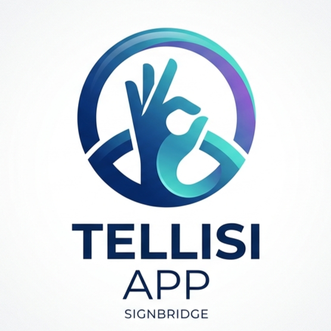
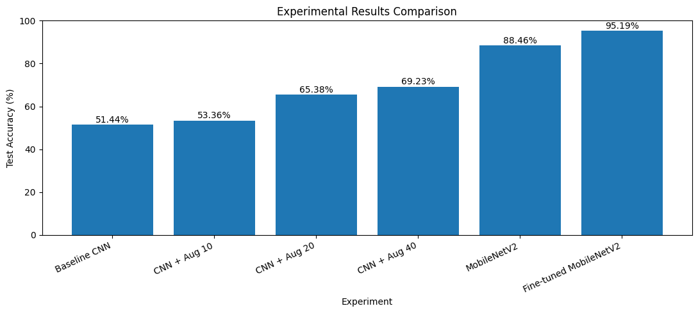
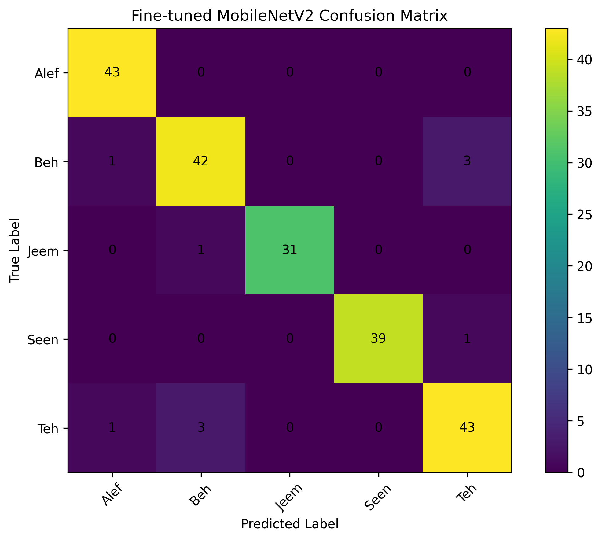
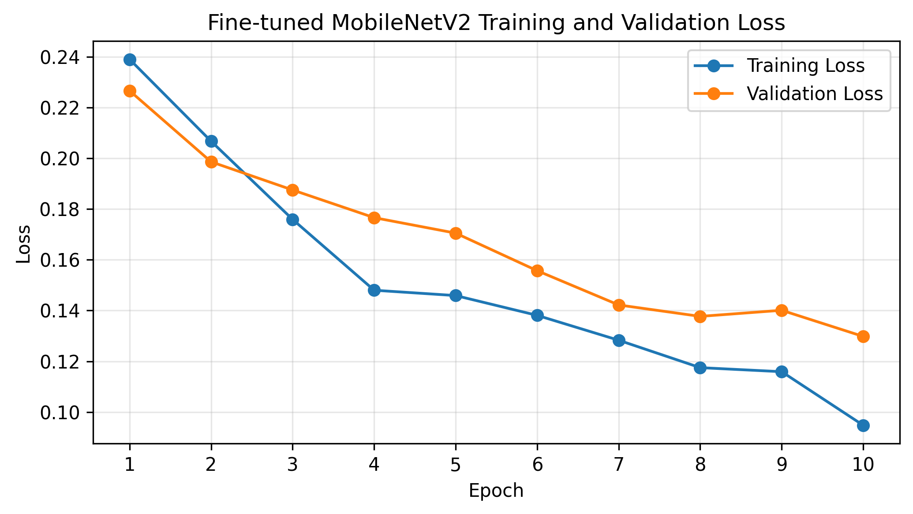
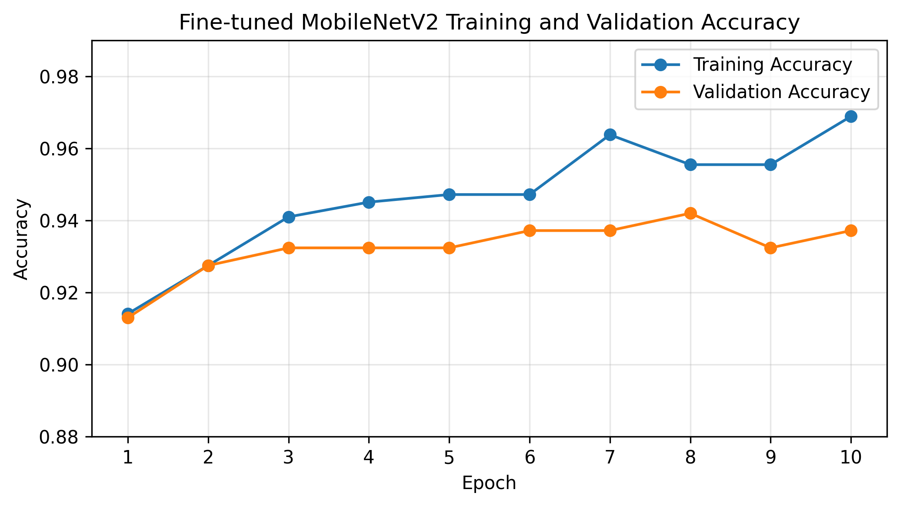
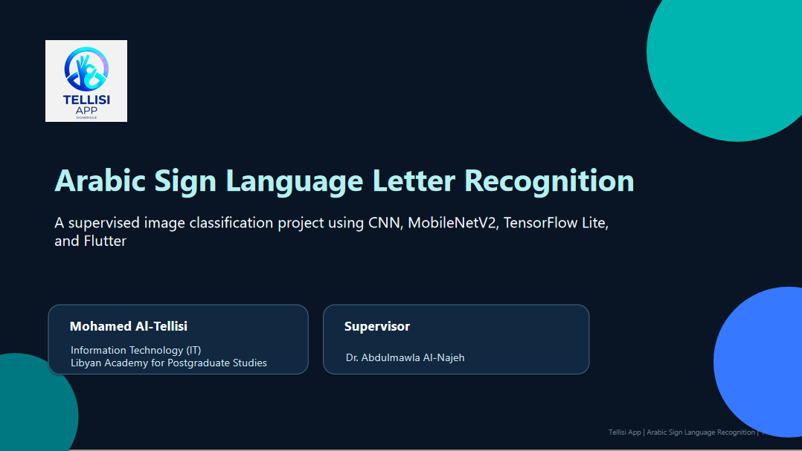

# Tellisi AI

<div align="center">

<!-- Replace this banner with your own image if available -->


<br />


<h3>Arabic Sign Language Recognition using CNN and MobileNetV2</h3>

<p>
  <a href="./paper/tellisi_paper_academy_updated.pdf">
    
  </a>
  &nbsp;
  <a href="./tellisi_app/app-release.apk">
    
  </a>
</p>

</div>

---

## Table of Contents

- [About the Project](#about-the-project)
- [Project Structure](#project-structure)
- [Screenshots](#screenshots)
- [Dataset](#dataset)
- [Methodology](#methodology)
- [Experimental Results](#experimental-results)
- [Error Analysis](#error-analysis)
- [Mobile Deployment](#mobile-deployment)
- [Tech Stack](#tech-stack)
- [How to Run](#how-to-run)
- [Future Work](#future-work)
- [Author](#author)

---

## About the Project

**SignBridge AI** is a deep learning project designed to recognize selected **Arabic Sign Language (ArSL)** letters from RGB hand gesture images.

The project starts with a baseline CNN model, then improves the model using augmentation and better training settings, and finally uses **Transfer Learning with MobileNetV2** to achieve high accuracy. The final model is prepared for mobile deployment using **TensorFlow Lite**.

### Why this project matters

Arabic Sign Language is an important communication method for deaf and hard-of-hearing Arabic speakers. Automated sign recognition can help make communication more accessible, scalable, and available through mobile devices.

---

## Key Features

- Arabic Sign Language image classification
- CNN model built from scratch
- Data augmentation pipeline
- Transfer Learning using MobileNetV2
- Fine-tuned final model
- TensorFlow Lite export for mobile use
- Android APK available for testing
- Academic paper included

---

## Project Structure

```bash
signbridge_ai/
├── notebook/
│   ├── training_notebook.ipynb
│   ├── experiments.ipynb
│   └── evaluation.ipynb
│
├── paper/
│   ├── tellisi_ieee_paper_academy_updated_source.zip
│   └── tellisi_paper_academy_updated.pdf
│
├── RGB ArSL dataset/
│   ├── Alef/
│   ├── Beh/
│   ├── Teh/
│   ├── Jeem/
│   └── Seen/
│
├── tellisi_app/
│   ├── app-release.apk
│   ├── lib/
│   ├── assets/
│   ├── android/
│   └── pubspec.yaml
│
├── model/
│   ├── signbridge_model.keras
│   ├── signbridge_model.tflite
│   └── labels.txt
│
├── assets/
│   ├── screenshots/
│   │   ├── app-home.jpg
│   │   ├── app-camera.jpg
│   │   ├── app-prediction.jpg
│   │   └── app-result.jpg
│   │
│   ├── results/
│   │   ├── accuracy-comparison.png
│   │   ├── confusion-matrix.png
│   │   ├── training-curves.png
│   │   └── sample-predictions.png
│   │
│   └── presentation/
│       ├── slide-1.png
│       ├── slide-2.png
│       ├── slide-3.png
│       └── slide-4.png
│
└── README.md
```

> Rename files if needed, but keep the structure clean so GitHub visitors can understand the project quickly.

---

## Screenshots

### Mobile Application

<p align="center">
  
  
  
  
</p>

### Model Results

<p align="center">
  
  
</p>

<p align="center">
  
  
</p>

### Presentation Preview

<p align="center">
  
  
</p>

---

## Dataset

The dataset contains RGB images for five Arabic Sign Language letters.

| Class | Arabic Letter | Number of Images |
|------:|:-------------:|-----------------:|
| Alef  | ا | 287 |
| Beh   | ب | 307 |
| Teh   | ت | 311 |
| Jeem  | ج | 210 |
| Seen  | س | 266 |

**Total images:** `1,381`

### Data Split

| Split | Percentage | Images |
|------:|-----------:|-------:|
| Train | 70% | 967 |
| Validation | 15% | 207 |
| Test | 15% | 207 |

---

## Methodology

### 1. Data Preparation

The image preparation pipeline includes:

- loading RGB image paths and labels,
- resizing images,
- normalizing pixel values to `[0, 1]`,
- applying augmentation only to training data,
- batching and shuffling the training dataset.

### 2. Data Augmentation

To reduce overfitting and improve generalization, the training set was augmented using:

| Technique | Value |
|----------|-------|
| Rotation | ±10° |
| Zoom | 10% |
| Width / Height Shift | 10% |
| Brightness Range | 0.8 - 1.2 |

### 3. Baseline CNN

The first model was a simple CNN built from scratch:

```text
Input 64x64x3
→ Conv2D + ReLU
→ MaxPooling2D
→ Conv2D + ReLU
→ MaxPooling2D
→ Flatten
→ Dense
→ Softmax
```

Baseline result:

```text
Test Accuracy: 51.44%
```

### 4. Improved CNN

The CNN was improved by:

- increasing filters,
- increasing dense neurons,
- adding dropout,
- adding data augmentation,
- increasing epochs,
- using EarlyStopping and ReduceLROnPlateau callbacks.

Best improved CNN result:

```text
Test Accuracy: 69.23%
```

### 5. Transfer Learning with MobileNetV2

MobileNetV2 was used as a pre-trained feature extractor.

```text
MobileNetV2 Base Model
→ GlobalAveragePooling2D
→ Dense 128 + ReLU
→ Dropout 0.3
→ Dense 5 + Softmax
```

Feature extraction result:

```text
Test Accuracy: 88.46%
```

### 6. Fine-Tuning

The final step was fine-tuning the last layers of MobileNetV2 using a very small learning rate.

Fine-tuned result:

```text
Test Accuracy: 95.19%
```

---

## Experimental Results

| Experiment | Model / Strategy | Test Accuracy |
|-----------:|------------------|--------------:|
| 1 | Baseline CNN, 5 epochs | 51.44% |
| 2 | CNN + Augmentation, 10 epochs | 53.36% |
| 3 | CNN + Augmentation, 20 epochs | 65.38% |
| 4 | CNN + Augmentation, 40 epochs | 69.23% |
| 5 | MobileNetV2 Feature Extraction | 88.46% |
| 6 | MobileNetV2 Fine-Tuning | 95.19% |

### Main Finding

Transfer Learning produced the largest improvement. Fine-tuned MobileNetV2 achieved the best result with **95.19% test accuracy**.

---

## Error Analysis

The final model was evaluated using:

- test set predictions,
- confusion matrix,
- manual review of wrong predictions,
- extracted misclassified samples,
- comparison between true and predicted labels.

The final model produced only a small number of wrong predictions out of the 207 test images, showing strong performance on the selected five classes.

---

## Mobile Deployment

The trained model was converted to TensorFlow Lite for mobile inference.

```text
Keras Model (.keras)
       ↓
TensorFlow Lite Converter
       ↓
TFLite Model (.tflite)
       ↓
Android Application
```

### Mobile Benefits

- Fast inference
- Offline usage
- Better privacy because images stay on the device
- Lightweight model suitable for mobile phones

---

## Tech Stack

| Area | Tools |
|------|-------|
| Programming | Python |
| Deep Learning | TensorFlow, Keras |
| Model | CNN, MobileNetV2 |
| Data Processing | NumPy, Pandas |
| Visualization | Matplotlib |
| Mobile Deployment | TensorFlow Lite |
| App | Android / Flutter |
| Documentation | IEEE-style paper, GitHub README |

---

## How to Run

### 1. Clone the repository

```bash
git clone https://github.com/YOUR_USERNAME/signbridge_ai.git
cd signbridge_ai
```

### 2. Install Python dependencies

```bash
pip install tensorflow numpy pandas matplotlib scikit-learn
```

### 3. Open the notebook

Open the notebook from:

```bash
notebook/
```

Then run the training or evaluation cells.

### 4. Test the mobile app

Download the APK from the button at the top of this README or from:

```bash
tellisi_app/app-release.apk
```

---

## Future Work

- Expand the model to all Arabic Sign Language letters
- Add real-time camera recognition
- Improve recognition under different lighting conditions
- Train on larger and more diverse datasets
- Add word and sentence-level sign recognition
- Improve mobile app UI/UX and accessibility

---

## Author

**Mohamed Tellisi**

AI / Deep Learning Project  
Arabic Sign Language Recognition

---

## Academic Paper

The academic paper is available in the `paper/` directory.

```bash
paper/tellisi_paper_academy_updated.pdf
```

---

## License

This project is currently provided for academic and research purposes.

You can add an open-source license later, such as:

- MIT License
- Apache License 2.0
- Creative Commons license for research material
